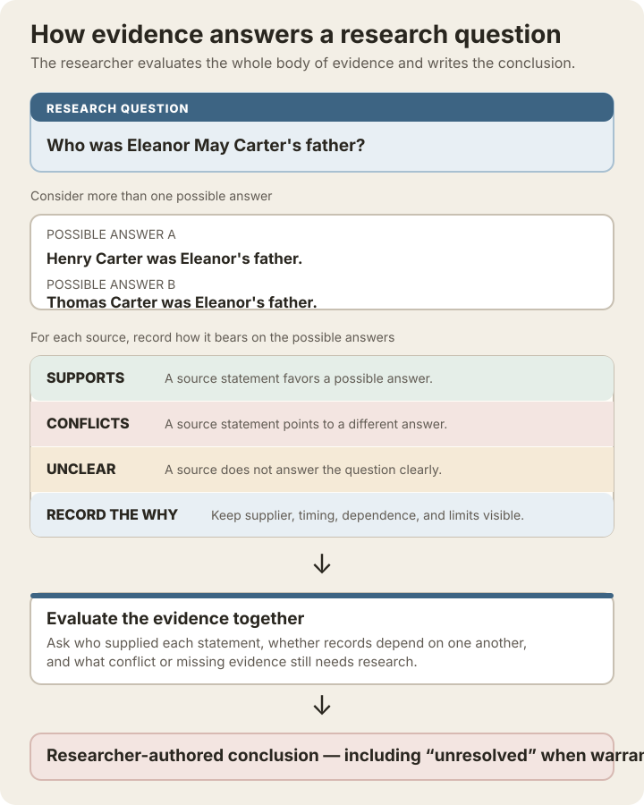

# Evidence assessment and identity conclusion architecture

**Status:** R1-approved contract; internal offline vertical slice implemented; R2
passed after focused correction and verification
**Decision date:** 2026-08-22
**Drivers:** Professional Genealogist Usability Review and principal architecture
analysis

## Decision summary

graver models external candidates, source observations, comparison signals,
researcher assessments, and identity conclusions as separate concepts linked to a
research subject.

Machine-generated similarity is used only to order candidates and direct attention.
It cannot create, modify, or imply an accepted genealogical identity conclusion.
Only an explicit reviewed decision may establish or withdraw an accepted external
identity association.



The fictional example demonstrates the contract in researcher language. It does
not assign proof weight by counting sources: dependence, informant knowledge,
conflicts, and missing evidence remain part of the researcher's analysis.

### Diagram in words

The example asks who Eleanor May Carter's father was. It keeps two possible answers
visible: Henry Carter and Thomas Carter.

| Source observation | Bearing on Henry | Bearing on Thomas | Limitation to retain |
| --- | --- | --- | --- |
| Marriage register | Supports: names Henry. | Conflicts: names a different father. | Informant is not stated. |
| Death certificate | Supports: repeats Henry. | Conflicts: names a different father. | Eleanor's husband supplied personal details, so it may not be independent of another record. |
| Memorial page | Conflicts: names a different father. | Supports: displays Thomas. | No underlying source was captured. |
| 1900 census household | Unclear. | Unclear. | Household presence does not establish parentage. |

The fictional conclusion is **unresolved**: the records favor Henry, but the
conflicting memorial statement has not been adequately explained. That is a valid
research conclusion, not a failed attempt to produce one.

This contract was defined before the public workspace façade so that the CLI,
future GUI, and other clients can share one coherent application model. The first
implementation slice is complete: it is entirely offline and uses curated provider
fixtures. It adds neither live FamilySearch access nor a production GUI.

## Context

The research subject introduced in schema v2 is an opaque owner of person-level
research. Find a Grave memorials remain source records associated with that subject;
their presence does not by itself constitute a cross-platform identity conclusion.

The professional usability review found that the visible workflow ends after Find a
Grave acquisition. It also found that a generic status, note, or unexplained
confidence value would not support rigorous evidence analysis. The domain therefore
needs an explicit boundary between discovery, comparison, assessment, and
conclusion before external-provider or GUI concerns shape it accidentally.

## Terminology and ownership

### Research subject

The internal organizational owner of research work. It is not itself a claim that
all associated source records describe the same genealogical person.

### Source observation

An immutable record of information observed from a source at a particular time.
Original values remain preserved. Normalized values and later conclusions never
replace them.

For a full Find a Grave observation, source assertions may include the page's
structured **Find a Grave-displayed relationship links — website display, not
proven kinship** (for example Parents, Spouse, Children, or Siblings). Preserve the
displayed relationship label, linked memorial ID and URL,
displayed name and life detail, and observation time. Such a record asserts only
that Find a Grave displayed the link in that group. It does not prove the
relationship, retrieve or validate the linked memorial, establish reciprocity,
associate research subjects, or create a family-tree edge.

### Discovery run

One bounded attempt to discover candidates for a subject from a named provider. It
records inputs, time, provider, outcome, and returned candidate references,
including successful searches with no results.

### Candidate

A provider-scoped external profile proposed for investigation. A candidate is a
hypothesis, not an accepted identifier or subject fact.

### Candidate snapshot

An immutable observation of a candidate profile during one discovery run. Later
runs create new snapshots when the provider data changes; they never rewrite prior
snapshots.

### Comparison signal

A reproducible, explainable comparison between referenced assertions. A signal may
support candidate ordering, oppose it, remain neutral, or require researcher review.
It is not a conclusion.

### Candidate assessment

The researcher's evolving work on a candidate, including workflow state, notes,
evidence dispositions, negative searches, unresolved questions, and reopening
history.

### Identity conclusion

An explicit, immutable reviewed decision that accepts, rejects, leaves unresolved,
withdraws, or supersedes a prior identity conclusion. Only an accepted conclusion
may establish an accepted subject-to-provider identity association.

## Domain separation

```text
research_subject
  ├── source observations
  ├── discovery runs
  │     └── candidate snapshots
  ├── comparison signals
  ├── evolving candidate assessment
  └── immutable identity conclusions
```

Find a Grave redirects remain platform behavior. They do not create candidates,
subject membership, or identity conclusions.

## Implemented persistence concepts

The schema and typed evidence services implement the following logical records.
Exact table names remain persistence details outside the supported application API.

### Discovery run

- Stable run identifier
- Research subject identifier
- Provider
- Search inputs in a stable structured representation
- Started and completed timestamps
- Outcome: completed, no results, interrupted, failed, or access restricted
- Safe error classification where applicable
- Adapter or search-strategy version

Discovery runs are immutable. Repeating the same query creates another run.

### Candidate identity and snapshot

- Provider-scoped candidate identifier
- Research subject identifier
- Discovery run identifier
- Provider profile identifier and URL when available
- Observation timestamp
- Original provider data or an immutable structured projection
- Snapshot content hash for change detection
- Explicit presence in the run

A candidate absent from a later run remains preserved and is not automatically
rejected.

### Assertion reference

Comparison inputs reference observed assertions rather than copying them into a
mutable matched profile. An assertion reference identifies:

- source observation or candidate snapshot;
- assertion kind, such as name, event, place, relationship, or identifier;
- path or stable assertion identifier within the observation; and
- original observed representation.

### Comparison signal

- Signal identifier
- Subject and candidate identifiers
- Referenced assertions on both sides
- Fact or relationship type
- Classification
- Normalized values used by the comparison
- Algorithm or rule version
- Numeric contribution when used for ordering
- Plain-language explanation
- Creation timestamp

Initial classifications are implementation identifiers. Researcher-facing clients
must render `exact` as **exact value agreement** and explain that it establishes
neither truth, source independence, nor identity:

- `exact`
- `compatible`
- `inferred`
- `missing`
- `conflict`
- `not_comparable`
- `review_required`

Missing data contributes neither positive agreement nor negative conflict unless a
specific documented rule establishes otherwise.

### Candidate assessment

Assessment workflow states are distinct from conclusions:

- `new`
- `reviewing`
- `deferred`
- `reopened`
- `ready_for_decision`

Deferral requires a reason and follow-up condition or review date. Reopening
requires a reason and a link to the earlier record. Ready for decision is a workflow
choice, not confidence, proof, certification of reasonably exhaustive research, or
automatic permission to conclude.

Assessment history retains actor, timestamp, reason, before and after state, notes,
negative searches, unresolved questions, and researcher dispositions of comparison
signals. No-op updates create no event.

### Identity conclusion

Conclusion dispositions are implementation identifiers. Researcher-facing
acceptance means **accepted as the same person** and does not accept every assertion
on either profile; assertions retain their own evidentiary status:

- `accepted`
- `rejected`
- `unresolved`
- `withdrawn`

Each conclusion requires:

- Subject and provider candidate
- Disposition
- Researcher or reviewer
- Decision timestamp
- Reasoned analysis
- Specific, inspectable evidence and comparison references identifying the
  observation or record, observation date, and relevant assertions
- Explicit treatment of every material conflict
- Reference to the superseded conclusion when applicable

Conclusion records are immutable. Correction occurs through supersession. A
withdrawal refers to the conclusion being withdrawn and does not delete it.

## Candidate ranking contract

Candidate ranking is optional decision support. It is not proof or confidence.

The offline slice implements deterministic review ordering under these rules:

- deterministic for the same inputs and algorithm version;
- versioned and recomputable;
- explicit about missing and incomparable data;
- composed of inspectable signals;
- presented as ordering rather than a probability of identity; and
- incapable of changing assessment or conclusion state.

The typed result contains the rank, candidate count, algorithm version, signal
summary, material-conflict count, unknown count, and complete signal explanations.
A raw score may exist internally or in an expanded diagnostic result, but ordinary
presentation leads with evidence counts and conflicts rather than a percentage.

The complete comparison context also identifies the exact input snapshots and
assertions, original and normalized representations, applied rule identifiers and
versions, researcher overrides, and ordering effects. A changed rule or override
creates a new comparison context and never rewrites earlier research history. Rule
transparency, non-configurable evidence safeguards, computational replay, audit
export, and AI provenance are governed by the
[trust, transparency, and openness architecture](trust-transparency-architecture.md).

## Application-service boundary

Illustrative service capabilities are:

```text
workspace.candidates.record_discovery(...)
workspace.candidates.list(...)
workspace.candidates.refresh_from_fixture(...)
workspace.evidence.compare(...)
workspace.evidence.explain(...)
workspace.assessments.show(...)
workspace.assessments.update(...)
workspace.conclusions.record(...)
workspace.conclusions.history(...)
```

These names demonstrate ownership only and do not freeze the final public API.

Services return typed requests and results. They do not return SQLite rows, render
terminal content, emit Qt signals, or serialize CLI JSON. CLI and future GUI are
clients of the same services, with distinct product and usability roles.

All meaningful mutations use optimistic concurrency or an equivalent stale-update
guard. A client that attempts to save an assessment based on an older version must
receive a typed conflict rather than overwrite newer research.

## Acquisition receipt and citation boundary

Search and enrichment services return typed receipts containing:

- database or workspace identity;
- provider and requested scope;
- records discovered, created, changed, unchanged, and failed;
- changed memorial identifiers and before-and-after working values, with routes to
  earlier and later snapshots;
- dated snapshots retained without replacing earlier snapshots;
- start and completion times; and
- a suggested next action.

Citation projections derive only from captured source metadata. They must
distinguish information absent in the observed source from information not
collected, outside scope, or unavailable; they must not imply that an image or
underlying record was examined when it was not. Every displayed acquired fact must
be traceable to its source observation.

## Completed offline vertical slice

The implemented slice uses curated, deterministic FamilySearch-shaped fixtures and
no provider authentication or network access.

It demonstrates:

1. An existing research subject in the current schema.
2. One discovery run returning at least two plausible candidates.
3. Immutable candidate snapshots containing facts, relationships, and source
   references.
4. A second discovery run containing one materially changed candidate and one
   candidate absent from the new results.
5. Explainable comparisons with agreement, missing information, and a material
   relationship conflict.
6. Candidate deferral and later reopening.
7. A researcher-recorded rejected, unresolved, or accepted conclusion.
8. A later conclusion that supersedes rather than overwrites an earlier decision.
9. Complete history preserved without an automatic identity association.

Application-service contract tests and a minimal non-public review adapter exercise
the slice. The primary CLI was not expanded with persistence-shaped commands merely
to expose every operation.

## Interface contract for future clients

The implemented typed comparison projection supports:

- persistent active-subject identity;
- stable candidate identity and navigation;
- fact and relationship comparison rows;
- textual agreement classifications;
- original and normalized values;
- citations and observation details on demand;
- ranking explanations;
- unsaved-change and stale-update protection; and
- conclusion controls separate from candidate ordering.

This is an application contract, not a commitment to PyQt6 or a particular layout.

## Invariants

- A candidate never becomes an accepted identity association automatically.
- Machine ranking never changes assessment or conclusion state.
- Original source observations and candidate snapshots are immutable.
- Source-displayed related memorials remain observed relationship assertions, not
  accepted family relationships.
- Normalization never replaces an observed value.
- Missing values do not silently count as agreements.
- Material conflicts remain visible until explicitly addressed.
- Re-running discovery never erases candidate, assessment, or conclusion history.
- Absence from a later result set is not proof of non-identity.
- Rejected and unresolved candidates can be reopened only through a recorded action.
- Conclusions require a human actor, reasoning, evidence references, and conflict
  treatment.
- Later conclusions supersede rather than mutate prior conclusions.
- Find a Grave aliases do not establish subject membership or cross-platform
  identity.
- CLI and future GUI use the same typed application services.

## Non-goals for this milestone

- Live FamilySearch authentication or requests
- A production FamilySearch adapter
- A production GUI
- Automatic acceptance thresholds
- A general-purpose family-tree editor
- WikiTree matching or writes
- GEDCOM import or export
- Subject merge or split
- A comprehensive citation-style engine
- Freezing exact public workspace method names before the consumer spike

## Verified behavior

- Curated fixtures include ambiguous names, compatible dates, material relationship
  conflicts, derivative sources, missing facts, and changing provider snapshots.
- Contract tests prove deterministic signal explanations and ranking.
- Tests prove that high rank cannot create a conclusion.
- Tests prove discovery reruns and conclusion supersession preserve history.
- Tests prove stale updates fail without losing either researcher's work.
- Adapter-parity tests confirm CLI/test projections derive from the same typed
  results intended for a future GUI.
- All tests deny network access by default.

## Consequences

This decision adds domain depth before provider integration, but it prevents the
public API and GUI from encoding acquisition-only assumptions. It also makes the
first FamilySearch work testable without credentials, provider instability, or UI
technology.

The model carries more records than a mutable candidate table or single confidence
column. That cost is justified by research-data integrity, repeatable discovery,
explainability, and reversible conclusions.
