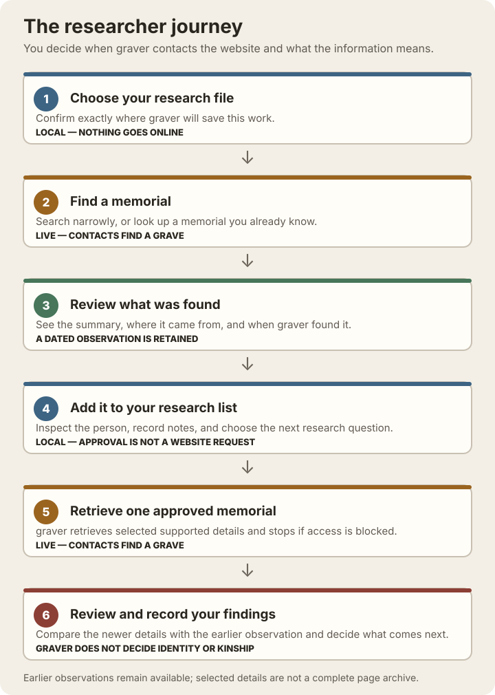

# Research one Find a Grave memorial with graver

This tutorial is for genealogical researchers who are comfortable entering
commands but do not need to know Python or SQLite. If those terms or the terminal
are unfamiliar, begin with the [plain-language setup guide](first-time-setup.md).
This tutorial creates a dedicated
database, acquires a deliberately small summary result set, and observes one
memorial's full page only after you approve it.

Commands below assume the installed command is named `graver`. If you are
working from a source checkout, use `uv run graver` anywhere the examples say
`graver`. `python -m graver` is also available as an equivalent troubleshooting
fallback when graver is installed in the active Python environment.

## The workflow

```text
Choose a research database
  → search narrowly for a memorial
  → save the search result and add the person to your work list
  → review the person before making another request
  → approve one memorial-page lookup
  → see which supported details were added or changed
  → keep both the earlier and later dated snapshots
```

graver does not automatically retrieve every full memorial page. Summary
searches can establish a useful research queue with fewer requests; a researcher
then decides which one person merits a full retrieval. This reduces load on Find
a Grave and prevents unattended bulk enrichment. In graver's exact vocabulary, a
dated saved snapshot is an **observation**, and the summary of what one operation
stored is an **acquisition receipt**.



Step labels and notes distinguish local work, live website contact, retained history,
and researcher decisions. Color is only a visual aid.

## 1. Verify the installation

These commands are offline:

```shell
graver --version
graver --help
```

Success means the first command reports graver's installed version and the
second lists commands including `init`, `use`, `search`, and `work`. At any point,
append `--help` at the level you need, for example `graver work --help` or
`graver work enrich --help`.

## 2. Create an isolated tutorial database

Create a new directory yourself, enter it, and initialize the database. The
directory name is only an example; use a location you can identify later.

```shell
mkdir graver-tutorial
cd graver-tutorial
graver init tutorial.db
graver use --show
```

`mkdir` creates the new folder inside the folder where the terminal is currently
located. `cd` moves the terminal into it, so `tutorial.db` is created there. If you
prefer another location, first navigate to a familiar folder such as Documents, or
use a full path you recognize and intend to back up.

The `init` success message identifies the absolute path:

```text
Initialized and selected research database: /.../graver-tutorial/tutorial.db
```

`use --show` should report that same absolute path. Both graver commands are
offline. Keep the path: it distinguishes this practice database from other
research databases.

The three database commands have deliberately separate jobs:

- `graver init DATABASE` creates a new current-schema database and selects it.
  It refuses every existing path. With no argument, it creates `./graves.db`.
- `graver use DATABASE` selects an existing compatible database without creating
  or upgrading it.
- `graver admin database upgrade DATABASE` creates a required sibling backup and
  explicitly upgrades a recognized older database. Selection and ordinary reads
  never migrate a database.

You should not need the upgrade command for the newly initialized tutorial
database.

## 3. Acquire one small summary result set

The following recommended example contacts Find a Grave. It asks for memorial
ID `1075`, the public George Washington memorial, and caps processing at one
result:

```shell
graver search --memorial-id 1075 --max-results 1
```

Success prints an acquisition receipt—a plain summary of what graver just saved:
summaries observed, new and existing
memorial counts, and confirmation that dated snapshots were retained without
replacing earlier snapshots. If a new observation changed the current displayed
representation of an existing memorial, the receipt lists each changed field with
its earlier and new value. Find a Grave is a changing live service, so the memorial
is not promised to appear first—or to be returned at all. You will identify it after queueing by
looking for literal memorial ID `1075`. If this example stops being reliable,
substitute a memorial ID you already know, or use a narrow cemetery query shown
by `graver search --help`; keep `--max-results` small.

Search results are summary records. They may contain a name, dates, source URL,
and cemetery context, but they are not evidence that graver observed the full
memorial page. A receipt describes what graver stored; it does not certify that the
website's statements are correct.

## 4. Queue and inspect a person

These commands are offline:

```shell
graver work queue
graver work list --limit 10
graver work next
graver work show 1075
```

`work queue` should say how many people were added and how many were already
present. Repeating it is safe. `work list` identifies people by memorial ID;
look for `1075`, or choose another literal ID returned by your search and use it
in place of `1075` below. `work next` normally selects the next `unprocessed`
person. `work show` should identify the person, the `unprocessed` research state,
the cemetery context, `summary` acquisition level, and an acquisition-observation
count.

All research-state changes are offline. See the
[research-state guide](research-states.md) for every accepted value, its plain-
language meaning, and what later action it permits.

In the commands that follow, `1075` is literal only if that memorial was acquired.
In generic examples, `MEMORIAL_ID` is a placeholder and must be replaced with the
number you selected.

## 5. Approve and enrich exactly one memorial

Approval is offline:

```shell
graver work mark 1075 --status ready_for_full_scrape \
  --note "Approved during the tutorial"
graver work show 1075
```

Success means graver reports that the status and note were updated. The second
command should show `Approved for enrichment [ready_for_full_scrape]` and offer
the live `graver work enrich 1075` command as the next action. Only this one task
was approved; marking it did not make a request.

Enrichment is the tutorial's second live Find a Grave operation:

```shell
graver work enrich 1075
```

Success reports that selected fields from the memorial's full page were retained as
a dated observation and that this is not a complete page archive. Its acquisition
receipt links the earlier and new selected-field observations, lists newly retained
and different retained values, separately identifies earlier values for which
nothing was retained in the new observation, summarizes equal non-null values
without treating equality as corroboration, and counts retained Find a
Grave-displayed relationship links with an explicit non-proof warning. A missing
later value does not establish whether the information was not displayed, not
collected, not retained, or not examined, and a difference does not supersede the
earlier value. graver retrieves only the approved memorial—no related memorials and
no other queued people.

Inspect the result offline:

```shell
graver work show 1075
graver work show 1075 --history
```

Verify the following researcher-facing facts rather than exact borders, spacing,
paths, or timestamps:

- the research state is `Enrichment complete [full_scrape_complete]`;
- the acquisition level says that full-page fields were retained;
- source history (called provenance) includes both the earlier summary and
  successful full-page observations; and
- the acquisition receipt identifies those retained observations and explains any
  displayed-value changes without presenting the newer value as verified; and
- the memorial and cemetery context still identify the person you approved.

`--history` intentionally reveals immutable observation detail. Optional values
such as plot, coordinates, biography presence, and birth or death places may
legitimately be absent. The machine value `full` means that graver observed the
full memorial page and retained its supported structured fields. It does **not**
mean that every optional field was populated or that graver saved the page,
biography text, images, contributor details, or every displayed element. The
[acquisition-scope guide](acquisition-scope.md) lists the retained categories,
known exclusions, and responsible citation boundary.

### Optional technical verification

When troubleshooting a script or integration, `graver work show 1075 --json`
returns the complete machine-readable record. Its envelope uses `schema_version` 1,
the command identifier is `work.show`, and the record is under `data`. These details
are documented in the [command-line JSON contract](cli-json.md); researchers do not
need them for the ordinary workflow.

## 6. Stop and resume safely

graver persists the queue, task state, current memorial data, and observations in
`tutorial.db`. You may close the terminal and later resume with:

```shell
graver use --show
graver work next
graver work list --limit 10
graver work show 1075
```

If you selected another database in the meantime, return to the tutorial with
`graver use /absolute/path/to/graver-tutorial/tutorial.db`. The saved selection is
shared across terminals and working directories. A global one-command option, such
as `graver --db /absolute/path/to/graver-tutorial/tutorial.db work next`,
temporarily overrides the selection but does not replace it.

## 7. Optional cleanup

Keeping `tutorial.db` for later practice is safe. If you decide to remove it,
first display and record the exact absolute path, then clear only graver's saved
preference:

```shell
graver use --show
graver use --clear
```

`use --clear` does not delete or alter the database. Delete the file only with a
specific, non-recursive operation appropriate to your operating system after you
have verified the exact path. Never use a broad wildcard or recursive deletion
for tutorial cleanup. If you changed an existing saved selection to follow the
tutorial, either restore that earlier selection explicitly or leave the preference
cleared before returning to other research.

## Live-service safety

Only `search` and `work enrich` contact Find a Grave; initialization, selection,
queueing, inspection, approval, and cleanup of the preference are offline. This
tutorial intentionally makes a very small number of requests. Cloudflare may
block, challenge, or delay access, and Find a Grave may time out or be unavailable.
Stop rather than repeatedly retrying. A live-site failure does not necessarily
mean the local installation or tutorial database is broken.

The automated tutorial workflow test uses deterministic mocks, rejects unexpected
network access, and never contacts Find a Grave.

## Troubleshooting

| Symptom | Safe next step |
| --- | --- |
| `graver: command not found` | Run `uv tool update-shell`, restart the terminal, and try `graver --help`. In a source checkout, try `uv run graver --help`. |
| Unsupported Python or incomplete installation | Reinstall using the project's documented uv workflow, then rerun `graver --version`. Retain the Python, uv, and graver versions if asking for help. |
| `tutorial.db` already exists | `init` will not overwrite it. Keep it and select it with `graver use tutorial.db` if it is compatible, or choose a new explicit filename. |
| No selected database | Run `graver use --show`, then `graver use /absolute/path/to/tutorial.db`. |
| Missing or invalid database path | Check the exact path and filename. `use` requires an existing, usable graver database and will not silently fall back. |
| Database requires explicit upgrade | Preserve the reported path and run `graver admin database upgrade DATABASE` only when you intend to create a backup and migrate that database. |
| Backup collision during upgrade | Stop and inspect the reported database and backup paths. graver will not overwrite the existing backup or begin migration. Preserve both files and consult the upgrade guide before deliberately changing either one. |
| No search results | Recheck the current `graver search --help`, try a known memorial ID or narrow cemetery query, and keep the result limit small. Do not loop rapid retries. |
| Cloudflare challenge or access block | Stop. Wait and use Find a Grave normally in a browser if appropriate; do not repeatedly automate retries. |
| Timeout or Find a Grave outage | Stop and try later. Offline commands can still inspect already persisted work. |
| Empty work queue | Confirm the search persisted a summary, confirm the selected database with `use --show`, then run `work queue`. |
| No actionable `work next` result | `work next` defaults to `unprocessed`. Use `work list` to see other states or `work next --status STATUS` when you intentionally want another state. |
| Task state prevents enrichment | Inspect the person, then explicitly run `work mark MEMORIAL_ID --status ready_for_full_scrape` if approval is appropriate. |
| Enrichment succeeds but optional fields are absent | This is valid: full acquisition records what the page supplied; it does not invent missing facts. |
| Unsure whether failure is local or live | If `init`, `use --show`, and `work show` succeed but `search` or `enrich` fails, the problem may be live access or a site/schema change. If offline commands fail, retain their exact error and selected database path. |
| Need command details | Use `graver --help`, `graver COMMAND --help`, or nested help such as `graver work show --help`. |
| Reporting a problem | Retain the command (remove secrets), graver/Python versions, semantic error text, selected database path, whether the step was offline or live, and whether Cloudflare appeared. Do not publish private genealogy data or configuration contents. |
